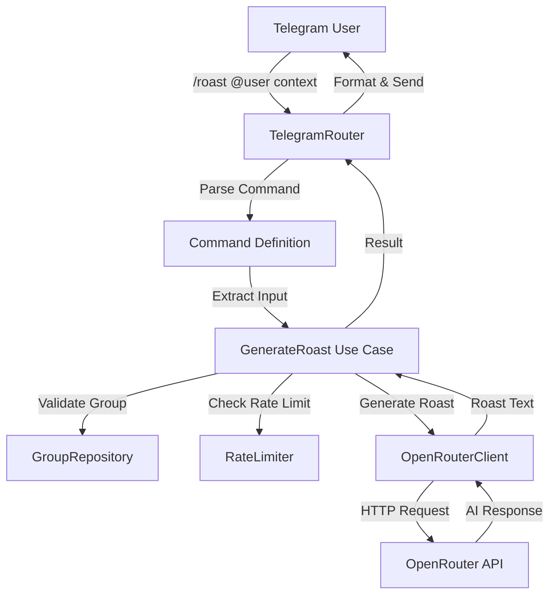

# Design Document: AI Roast Feature

## Overview

The AI Roast feature adds a `/roast` command to the Telegram bot that generates playful, AI-powered roasts of users in group chats. The feature integrates with OpenRouter's API to generate creative, humorous content based on user-provided context and configurable intensity levels (soft, hard, extra).

This feature serves dual purposes:

1. **Engagement driver**: Adds fun, interactive content to gaming communities
2. **AI integration pattern**: Establishes the OpenRouter integration architecture for future AI-powered features

The design follows Clean Architecture principles with clear separation between platform adapters (Telegram), use cases (business logic), and external connectors (OpenRouter API).

## Architecture

### High-Level Flow

```
Telegram Message
    ↓
TelegramRouter (command parsing & validation)
    ↓
GenerateRoast Use Case (orchestration & business logic)
    ↓
OpenRouterClient (HTTP API integration)
    ↓
AI Response
    ↓
TelegramRouter (response formatting & delivery)
```

### Component Diagram



## Components and Interfaces

### 1. Command Definition (Telegram Adapter Layer)

**Location**: `pkg/bot/adapters/telegram/commands/fun.ts`

The command definition uses the declarative TelegramRouter pattern to map the `/roast` command to the GenerateRoast use case.

```typescript
import type {Context} from "grammy";
import z from "zod";

import type {Dependencies} from "../../../services/base";
import {GenerateRoast} from "../../../services/ai/generate-roast";
import {commandRegistry} from "../command-registry";
import type {CommandDefinition} from "../types";

// Command input schema
const roastInputSchema = z.object({
  targetUsername: z.string().min(1),
  level: z.enum(["soft", "hard", "extra"]),
  context: z.string().max(500).optional(),
  groupId: z.string(),
  requesterId: z.string(),
});

type RoastInput = z.infer<typeof roastInputSchema>;

// Pattern: /roast @username [level] [context]
const ROAST_PATTERN = /^\/roast(?:\s+@(\w+))?(?:\s+(soft|hard|extra))?(?:\s+(.+))?$/i;

/**
 * Creates fun command definitions with the provided dependencies.
 */
export function createFunCommands(deps: Dependencies): CommandDefinition<unknown, unknown>[] {
  commandRegistry.register({
    command: "/roast",
    description: "Generate a playful AI roast of a user",
    usage: "/roast @username [soft|hard|extra] [context]",
    category: "Fun Commands",
  });

  return [
    {
      pattern: ROAST_PATTERN,
      chatFilter: "group",
      useCase: new GenerateRoast(deps),
      parseInput: (ctx: Context): RoastInput => {
        const text = ctx.message?.text ?? "";
        const match = text.match(ROAST_PATTERN);

        if (!match || !match[1]) {
          throw new Error("Usage: /roast @username [soft|hard|extra] [optional context]");
        }

        const [, username, level, context] = match;

        return {
          targetUsername: username,
          level: (level?.toLowerCase() as "soft" | "hard" | "extra") ?? "hard",
          context: context?.trim(),
          groupId: String(ctx.chat?.id),
          requesterId: String(ctx.from?.id),
        };
      },
      response: {type: "text", template: "{{roast}}"},
      errorResponse: {
        mappings: [
          {
            errorType: "NotFoundError",
            template: "This group is not connected. Use /connect_group first.",
          },
          {errorType: "ValidationError", template: "{{message}}"},
          {
            errorType: "RateLimitError",
            template: "Too many roasts! Try again in {{retryAfter}} seconds 🔥",
          },
        ],
        defaultTemplate: "Failed to generate roast: {{message}}",
      },
    },
  ] as CommandDefinition<unknown, unknown>[];
}
```

**Input Parsing Logic**:

- Extract target username from `@mention` format
- Parse optional roast level (case-insensitive, defaults to "hard")
- Capture remaining text as context
- Validate group chat context via `chatFilter: "group"`
- Extract group ID and requester ID for validation and rate limiting

### 2. GenerateRoast Use Case (Application Layer)

**Location**: `pkg/bot/services/ai/generate-roast.ts`

The use case orchestrates the roast generation process, handling validation, rate limiting, prompt construction, and error handling.

```typescript
import z from "zod";

import {NotFoundError, ValidationError} from "../../errors";
import {Base} from "../base";
import type {OpenRouterClient} from "../../connectors/openrouter/client";
import type {RateLimiter} from "../../utils/rate-limiter";

const inputSchema = z.object({
  targetUsername: z.string().min(1),
  level: z.enum(["soft", "hard", "extra"]),
  context: z.string().max(500).optional(),
  groupId: z.string(),
  requesterId: z.string(),
});

type Input = z.infer<typeof inputSchema>;

type Result = {roast: string};

export class GenerateRoast extends Base<Input, Result> {
  protected inputSchema = inputSchema;
  private openRouterClient: OpenRouterClient;
  private rateLimiter: RateLimiter;

  constructor(deps: Dependencies & {openRouterClient: OpenRouterClient; rateLimiter: RateLimiter}) {
    super(deps);
    this.openRouterClient = deps.openRouterClient;
    this.rateLimiter = deps.rateLimiter;
  }

  protected async checkPermissions(data: Input): Promise<void> {
    // Verify group is registered
    const group = await this.repos.group.findByTelegramId(data.groupId);
    if (!group) {
      throw new NotFoundError("Group not registered");
    }

    if (group.status !== "active") {
      throw new ValidationError("This group is not active");
    }
  }

  protected async execute(data: Input): Promise<Result> {
    // Check rate limits (user, group, global)
    await this.rateLimiter.checkLimit(`roast:user:${data.requesterId}`, 5, 60);
    await this.rateLimiter.checkLimit(`roast:group:${data.groupId}`, 20, 60);
    await this.rateLimiter.checkLimit("roast:global", 100, 60);

    // Construct prompt based on level and context
    const systemPrompt = this.buildSystemPrompt(data.level);
    const userPrompt = this.buildUserPrompt(data.targetUsername, data.context);

    this.logger.info(
      {targetUsername: data.targetUsername, level: data.level, hasContext: !!data.context},
      "Generating roast",
    );

    // Call OpenRouter API
    const roast = await this.openRouterClient.generateCompletion({
      systemPrompt,
      userPrompt,
      temperature: 0.8,
      maxTokens: 150,
    });

    return {roast};
  }

  private buildSystemPrompt(level: "soft" | "hard" | "extra"): string {
    const levelInstructions = {
      soft: "Light and gentle, like teasing a good friend. Keep it wholesome and avoid anything that could be taken the wrong way.",
      hard: "Humorous and creative, not mean-spirited or offensive. Witty burns that make everyone laugh.",
      extra:
        "Go all out with savage humor. Maximum roast energy while staying friendly. No mercy, but keep it fun.",
    };

    return `You are a witty roast master in a friendly gaming group chat. Generate a playful roast based on the context provided.

The roast should be:
- ${levelInstructions[level]}
- 2-3 sentences maximum
- In the same language as the user's request
- Focused on the provided context (if any)
- Avoid offensive, discriminatory, or harmful content
- Keep it fun and friendly

Generate a roast:`;
  }

  private buildUserPrompt(targetUsername: string, context?: string): string {
    if (context) {
      return `Target: @${targetUsername}\nContext: ${context}`;
    }
    return `Target: @${targetUsername}`;
  }
}
```

**Key Responsibilities**:

- Validate group registration and status
- Enforce rate limits at user, group, and global levels
- Construct level-appropriate system prompts
- Build user prompts with target and context
- Handle OpenRouter API errors gracefully
- Log roast generation events

### 3. OpenRouterClient (Infrastructure Layer)

**Location**: `pkg/bot/connectors/openrouter/client.ts`

The client wraps the official OpenRouter SDK (`@openrouter/sdk`) to provide a simplified interface for generating roast completions with retry logic, timeout handling, and error management.

```typescript
import {setTimeout} from "node:timers/promises";

import {OpenRouter} from "@openrouter/sdk";
import type {FastifyBaseLogger} from "fastify";
import z from "zod";

import {RateLimitError} from "../../errors";

// Request schema
const completionRequestSchema = z.object({
  systemPrompt: z.string(),
  userPrompt: z.string(),
  temperature: z.number().min(0).max(2).default(0.8),
  maxTokens: z.number().int().positive().default(150),
});

type CompletionRequest = z.infer<typeof completionRequestSchema>;

// Configuration
type OpenRouterConfig = {apiKey: string; defaultModel: string; timeout: number; maxRetries: number};

export class OpenRouterClient {
  private client: OpenRouter;

  constructor(
    private config: OpenRouterConfig,
    private logger: FastifyBaseLogger,
  ) {
    this.client = new OpenRouter({apiKey: config.apiKey});
  }

  async generateCompletion(request: CompletionRequest): Promise<string> {
    const validated = completionRequestSchema.parse(request);

    let lastError: Error | null = null;

    for (let attempt = 0; attempt <= this.config.maxRetries; attempt++) {
      try {
        const result = this.client.callModel({
          model: this.config.defaultModel,
          input: [
            {role: "system", content: validated.systemPrompt},
            {role: "user", content: validated.userPrompt},
          ],
          temperature: validated.temperature,
          maxTokens: validated.maxTokens,
        });

        // Set timeout using Promise.race
        const timeoutPromise = new Promise<never>((_, reject) => {
          globalThis.setTimeout(() => {
            reject(new Error("The roast generator is taking a coffee break ☕"));
          }, this.config.timeout);
        });

        const text = await Promise.race([result.getText(), timeoutPromise]);

        if (!text || text.trim().length === 0) {
          throw new Error("Empty content in OpenRouter response");
        }

        return text.trim();
      } catch (error) {
        lastError = error as Error;

        // Check for rate limit errors
        if (lastError.message.includes("429") || lastError.message.includes("rate limit")) {
          throw new RateLimitError("OpenRouter rate limit exceeded", 60);
        }

        // Don't retry on timeout errors
        if (lastError.message.includes("coffee break")) {
          throw lastError;
        }

        if (attempt < this.config.maxRetries) {
          const delay = Math.pow(2, attempt) * 1000; // Exponential backoff
          this.logger.warn(
            {attempt, delay, error: lastError.message},
            "Retrying OpenRouter request",
          );
          await setTimeout(delay);
        }
      }
    }

    this.logger.error({error: lastError?.message}, "OpenRouter request failed after retries");
    throw lastError ?? new Error("OpenRouter request failed");
  }
}
```

**Key Features**:

- Uses official `@openrouter/sdk` for API communication
- Zod validation for request parameters
- Configurable timeout with Promise.race
- Exponential backoff retry logic (1s, 2s delays) using `setTimeout` from `node:timers/promises`
- Proper error handling for rate limits and timeouts
- Structured logging for debugging
- Simplified configuration (no baseUrl needed, SDK handles it)

````

**Key Features**:

- Uses official `@openrouter/sdk` for API communication
- Zod validation for request parameters
- Configurable timeout with Promise.race
- Exponential backoff retry logic (1s, 2s delays)
- Proper error handling for rate limits and timeouts
- Structured logging for debugging
- Simplified configuration (no baseUrl needed, SDK handles it)

### 4. RateLimiter (Infrastructure Layer)

**Location**: `pkg/bot/utils/rate-limiter.ts`

In-memory rate limiter using a sliding window algorithm. Future enhancement will add Redis support for distributed rate limiting.

```typescript
import {RateLimitError} from "../errors";

type RateLimitEntry = {count: number; resetAt: number};

export class RateLimiter {
  private limits: Map<string, RateLimitEntry> = new Map();

  async checkLimit(key: string, maxRequests: number, windowSeconds: number): Promise<void> {
    const now = Date.now();
    const entry = this.limits.get(key);

    // Clean up expired entry
    if (entry && entry.resetAt < now) {
      this.limits.delete(key);
    }

    const current = this.limits.get(key);

    if (!current) {
      // First request in window
      this.limits.set(key, {count: 1, resetAt: now + windowSeconds * 1000});
      return;
    }

    if (current.count >= maxRequests) {
      const retryAfter = Math.ceil((current.resetAt - now) / 1000);
      throw new RateLimitError(`Rate limit exceeded`, retryAfter);
    }

    // Increment count
    current.count++;
  }

  // Cleanup method to prevent memory leaks
  cleanup(): void {
    const now = Date.now();
    for (const [key, entry] of this.limits.entries()) {
      if (entry.resetAt < now) {
        this.limits.delete(key);
      }
    }
  }
}
````

**Rate Limit Tiers**:

- **Per User**: 5 roasts per minute (prevents spam from individual users)
- **Per Group**: 20 roasts per minute (prevents group-wide spam)
- **Global**: 100 roasts per minute (protects API costs and OpenRouter limits)

### 5. Error Classes

**Location**: `pkg/bot/errors/index.ts`

Add new error class for rate limiting:

```typescript
// 429 Rate Limit
export class RateLimitError extends AppError {
  constructor(
    message: string,
    public retryAfter: number,
  ) {
    super("RATE_LIMIT", message, 429);
    this.name = "RateLimitError";
  }
}
```

## Data Models

### Configuration Schema Extensions

**Location**: `pkg/bot/config/index.ts`

Add OpenRouter and AI roast configuration to the existing config schema:

```typescript
export const openRouterConfigSchema = z.object({
  apiKey: z.string().min(1),
  defaultModel: z.string().default("openrouter/auto"),
  timeout: z.number().int().positive().default(5000),
  maxRetries: z.number().int().min(0).max(5).default(2),
});

export type OpenRouterConfig = z.infer<typeof openRouterConfigSchema>;

export const aiRoastConfigSchema = z.object({
  enabled: z.boolean().default(true),
  temperature: z.number().min(0).max(2).default(0.8),
  maxTokens: z.number().int().positive().default(150),
});

export type AiRoastConfig = z.infer<typeof aiRoastConfigSchema>;

// Update main config schema
export const configSchema = z.object({
  // ... existing fields ...
  openrouter: openRouterConfigSchema.optional(),
  ai: z.object({roast: aiRoastConfigSchema.optional()}).optional(),
});
```

**Note**: The `baseUrl` field has been removed from the configuration schema since the `@openrouter/sdk` handles the API endpoint internally.

### Command Input/Output Types

**Location**: `pkg/bot/adapters/telegram/types.ts`

```typescript
export type RoastCommandInput = {
  targetUsername: string;
  level: "soft" | "hard" | "extra";
  context?: string;
  groupId: string;
  requesterId: string;
};

export type RoastCommandOutput = {roast: string};
```

## Error Handling

### Error Types and Responses

| Error Type                    | Trigger                                                 | User-Facing Message                                      | HTTP Status |
| ----------------------------- | ------------------------------------------------------- | -------------------------------------------------------- | ----------- |
| `ValidationError`             | Missing username, invalid level, invalid mention format | Usage instructions with examples                         | 400         |
| `ValidationError`             | Context exceeds 500 characters                          | "Context too long! Maximum 500 characters."              | 400         |
| `NotFoundError`               | Group not registered                                    | "This group is not connected. Use /connect_group first." | 404         |
| `ValidationError`             | Group not active                                        | "This group is not active"                               | 400         |
| `RateLimitError`              | User/group/global rate limit exceeded                   | "Too many roasts! Try again in {retryAfter} seconds 🔥"  | 429         |
| `Error` (timeout)             | OpenRouter API timeout (5s)                             | "The roast generator is taking a coffee break ☕"        | 504         |
| `RateLimitError` (OpenRouter) | OpenRouter rate limit                                   | "Too many roasts! Try again in a moment 🔥"              | 429         |
| Generic `Error`               | Unexpected errors                                       | "Failed to generate roast. Please try again."            | 500         |

### Error Handling Strategy

**Use Case Layer**:

- Validate group registration and status
- Check rate limits before calling OpenRouter
- Catch and wrap OpenRouter client errors
- Log all errors with context for debugging

**OpenRouter Client Layer**:

- Implement timeout with AbortController
- Retry failed requests with exponential backoff
- Parse and validate API responses
- Throw specific errors for rate limits and timeouts

**Telegram Adapter Layer**:

- Map error types to user-friendly messages via `errorResponse` config
- Include retry timing in rate limit messages
- Reply to original message for context
- Never expose internal error details to users

### Logging Strategy

**Info Level**:

- Roast generation requests (username, level, hasContext)
- Successful roast generation (response length)
- Rate limit hits (user/group/global)

**Warn Level**:

- OpenRouter API retries (attempt number, delay)

**Error Level**:

- OpenRouter API failures (status code, error body)
- Timeout errors
- Unexpected errors with full stack traces

## Testing Strategy

### Unit Testing Focus

Tests should use Node.js built-in test runner (`node:test`) and focus on:

**Command Parsing Tests** (`pkg/bot/tests/unit/fun-command.test.ts`):

- Valid command formats with all variations
- Username extraction from @mention format
- Level keyword extraction (case-insensitive)
- Context extraction with and without level
- Invalid command rejection (missing username, invalid level)
- Context length validation (500 char limit)

**Use Case Tests** (`pkg/bot/tests/unit/generate-roast.test.ts`):

- Group validation (not found, inactive)
- Rate limit enforcement at all tiers
- Prompt construction for each level
- Context inclusion in prompts
- Error handling from OpenRouter client

**OpenRouter Client Tests** (`pkg/bot/tests/unit/openrouter-client.test.ts`):

- Request formatting and headers
- Response parsing and validation
- Timeout handling
- Retry logic with exponential backoff
- Rate limit error handling

**Rate Limiter Tests** (`pkg/bot/tests/unit/rate-limiter.test.ts`):

- First request in window succeeds
- Requests within limit succeed
- Request exceeding limit throws RateLimitError
- Window reset after expiry
- Cleanup removes expired entries

### Test Organization

```
pkg/bot/tests/
├── unit/
│   ├── connectors/
│   │   └── openrouter/
│   │       └── client.test.ts
│   ├── services/
│   │   └── ai/
│   │       └── generate-roast.test.ts
│   ├── utils/
│   │   └── rate-limiter.test.ts
│   └── adapters/
│       └── telegram/
│           └── commands/
│               └── fun.test.ts
```

### Manual Testing Checklist

Before deployment, manually verify:

- [ ] `/roast @username` generates a roast with default level
- [ ] `/roast @username soft` generates a gentler roast
- [ ] `/roast @username extra` generates a more intense roast
- [ ] `/roast @username context in Russian` generates Russian roast
- [ ] Rate limits trigger after threshold
- [ ] Unregistered groups receive error message
- [ ] Invalid commands show usage instructions

## Implementation Notes

### Dependency Injection

The feature requires new dependencies to be wired in the telegram plugin where other commands are registered:

```typescript
// In plugins/telegram.ts
import {OpenRouterClient} from "../connectors/openrouter/client";
import {RateLimiter} from "../utils/rate-limiter";
import {createFunCommands} from "../adapters/telegram/commands/fun";

const telegramPlugin: FastifyPluginAsync<TelegramPluginOptions> = async (fastify, opts) => {
  const bot = new Bot(opts.config.token);

  // Initialize OpenRouter client
  const openRouterClient = new OpenRouterClient(opts.config.openrouter, fastify.log);

  // Initialize rate limiter with periodic cleanup
  const rateLimiter = new RateLimiter();
  setInterval(() => rateLimiter.cleanup(), 60000);

  // Extended deps for AI features
  const aiDeps = {...opts.deps, openRouterClient, rateLimiter};

  // Create commands
  const adminCommands = createAdminCommands(opts.deps);
  const groupCommands = createGroupCommands(opts.deps);
  const funCommands = createFunCommands(aiDeps);
  const helpCommand = createHelpCommand(commandRegistry);

  const router = new TelegramRouter({
    bot,
    logger: fastify.log,
    commands: [helpCommand, ...adminCommands, ...groupCommands, ...funCommands],
  });

  // ... rest of plugin
};
```

### Configuration Example

Add to `local.config.json`:

```json
{
  "openrouter": {
    "apiKey": "sk-or-v1-...",
    "defaultModel": "openrouter/auto",
    "timeout": 5000,
    "maxRetries": 2
  },
  "ai": {"roast": {"enabled": true, "temperature": 0.8, "maxTokens": 150}}
}
```

**Note**: The `baseUrl` field is no longer needed as the `@openrouter/sdk` handles the API endpoint internally.

### File Structure

```
pkg/bot/
├── connectors/
│   └── openrouter/
│       └── client.ts           # OpenRouter SDK wrapper
├── services/
│   └── ai/
│       ├── index.ts            # Exports
│       └── generate-roast.ts   # GenerateRoast use case
├── utils/
│   └── rate-limiter.ts         # In-memory rate limiter
└── adapters/
    └── telegram/
        └── commands/
            └── fun.ts          # /roast command definition
```

**Dependencies**:

- `@openrouter/sdk` - Official OpenRouter SDK for API communication
- `eventemitter3` - Required peer dependency for the SDK
- `zod` - Schema validation (already in project)

## Security Considerations

### API Key Protection

- Store OpenRouter API key in config file (never in code)
- Config file should be gitignored
- Use environment variables in production
- Rotate API keys periodically

### Rate Limiting

- Implement rate limiting at multiple levels (user, group, global)
- Use Redis for distributed rate limiting in production
- Monitor rate limit hits for abuse detection

### Content Safety

- System prompt includes guardrails against offensive content
- Group admins can disable the feature (future enhancement)
- Never send PII beyond Telegram usernames

### Error Information Disclosure

- Never expose internal error details to users
- Log full error context server-side
- Use generic error messages for unexpected errors

## Performance Considerations

### OpenRouter API

- 5-second timeout prevents hanging requests
- Exponential backoff prevents API hammering
- Rate limiting protects against cost overruns

### Memory Management

- Rate limiter cleanup runs every minute
- In-memory storage suitable for MVP
- Plan Redis migration for production scale

### Response Time

- Target: < 3 seconds for roast generation
- OpenRouter API typically responds in 1-2 seconds
- Timeout at 5 seconds to prevent user frustration

## Future Enhancements

**Phase 2 (Post-MVP)**:

- Redis-backed rate limiting for distributed deployments
- Feature toggle per group (`/settings roast off`)
- Roast history tracking (most roasted users)
- `/compliment` counterpart command

**Phase 3 (Advanced)**:

- Multi-model support (allow groups to choose AI models)
- Custom system prompts per group
- Roast battles (two users roast each other)
- Per-group default roast level setting
