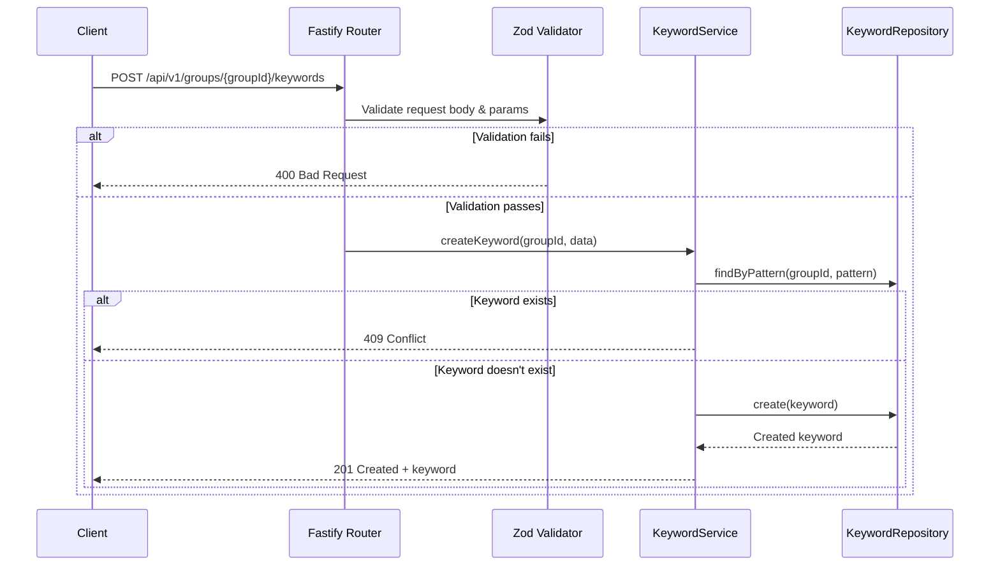

# Design Document: Keyword Notification System API

## Overview

This design document describes the REST API for managing keywords in the Keyword Notification System. The API follows RESTful conventions, uses Fastify as the HTTP framework, and leverages Zod for request/response validation with automatic OpenAPI documentation generation.

The API is designed to be consumed by the admin dashboard and other clients, providing CRUD operations for keywords scoped to groups (multi-tenant architecture).

## Architecture

The API follows the layered architecture defined in the project's architecture guidelines:

```
┌─────────────────────────────────────────────────────────────┐
│                    API Layer (Fastify)                       │
│  routes/api/v1/keywords.ts                                   │
│  - Route definitions with Zod schema validation              │
│  - Request parsing and response serialization                │
├─────────────────────────────────────────────────────────────┤
│                    Schema Layer (Zod)                        │
│  schemas/common/error.ts - Shared error response schemas     │
│  schemas/common/pagination.ts - Shared pagination schemas    │
│  schemas/keyword.ts - Keyword-specific schemas               │
├─────────────────────────────────────────────────────────────┤
│                    Service Layer                             │
│  services/keyword.service.ts                                 │
│  - Business logic (validation, conflict detection)           │
│  - Orchestration of repository calls                         │
│  - Depends on KeywordRepository interface (not implementation)│
├─────────────────────────────────────────────────────────────┤
│                    Repository Layer                          │
│  repositories/keyword.repository.ts                          │
│  - KeywordRepository interface (data access contract)        │
│  - InMemoryKeywordRepository (testing implementation)        │
│  - Future: KyselyKeywordRepository (PostgreSQL implementation)│
└─────────────────────────────────────────────────────────────┘
```

### Request Flow



## Components and Interfaces

### Schema Organization

Schemas are organized into two categories:

```
schemas/
├── common/                    # Shared schemas reusable across resources
│   ├── error.ts               # Error response schemas
│   └── pagination.ts          # Pagination schemas
└── keyword.ts                 # Keyword-specific schemas
```

### Repository Organization

Repositories abstract data access behind a generic interface with flexible field-based queries (`findOneBy`, `findAllBy`). Entity-specific repositories are simply typed aliases of the generic `Repository<T>`.

```
repositories/
├── repository.ts              # Generic Repository<T> interface with findOneBy/findAllBy
└── keyword.repository.ts      # KeywordRepository type alias + InMemoryKeywordRepository
```

### Service Organization

Services contain business logic and depend on repository interfaces:

```
services/
└── keyword.service.ts         # KeywordService class
```

### Common Schemas (schemas/common/error.ts)

```typescript
import z from "zod";

// Field-level validation error detail
export const errorDetailSchema = z.object({
  field: z.string().describe("Field path that caused the error"),
  message: z.string().describe("Human-readable error message for this field"),
});
export type ErrorDetail = z.infer<typeof errorDetailSchema>;

// Standard error response schema (reusable across all API resources)
export const errorResponseSchema = z.object({
  error: z.object({
    code: z.string().describe("Error code for programmatic handling"),
    message: z.string().describe("Human-readable error message"),
    request_id: z.string().optional().describe("Request ID for debugging"),
    details: z.array(errorDetailSchema).optional().describe("Field-level validation errors"),
  }),
});
export type ErrorResponse = z.infer<typeof errorResponseSchema>;
```

### Common Schemas (schemas/common/pagination.ts)

```typescript
import z from "zod";

// Pagination metadata schema (reusable for any list endpoint)
export const paginationSchema = z.object({
  total: z.number().int().min(0).describe("Total number of items"),
  limit: z.number().int().positive().describe("Maximum items per page"),
  offset: z.number().int().min(0).describe("Number of items skipped"),
});
export type Pagination = z.infer<typeof paginationSchema>;

// Common pagination query parameters
export const paginationQuerySchema = z.object({
  limit: z.coerce.number().int().positive().max(100).default(50),
  offset: z.coerce.number().int().min(0).default(0),
});
export type PaginationQuery = z.infer<typeof paginationQuerySchema>;
```

### Keyword Schemas (schemas/keyword.ts)

```typescript
import z from "zod";

import {paginationQuerySchema, paginationSchema} from "./common/pagination";

// Pattern type enum
export const patternTypeSchema = z.enum(["exact", "phrase", "wildcard"]);
export type PatternType = z.infer<typeof patternTypeSchema>;

// Base keyword fields
const keywordBaseSchema = z.object({
  pattern: z.string().min(1).max(100).describe("The keyword pattern to match"),
  pattern_type: patternTypeSchema.default("exact").describe("How the pattern should be matched"),
  case_sensitive: z.boolean().default(false).describe("Whether matching is case-sensitive"),
  cooldown_seconds: z.number().int().min(0).max(86400).default(0)
    .describe("Cooldown period in seconds between notifications (0 = no cooldown)"),
});

// Create request schema
export const createKeywordSchema = keywordBaseSchema.strict();
export type CreateKeywordRequest = z.infer<typeof createKeywordSchema>;

// Update request schema (all fields optional for partial updates)
export const updateKeywordSchema = keywordBaseSchema.partial().strict();
export type UpdateKeywordRequest = z.infer<typeof updateKeywordSchema>;

// Keyword resource schema (response)
export const keywordSchema = keywordBaseSchema.extend({
  pk: z.number().int().positive().describe("Primary key (serial)"),
  group_id: z.number().int().positive().describe("ID of the group this keyword belongs to"),
  created_at: z.string().datetime().describe("ISO 8601 timestamp of creation"),
  updated_at: z.string().datetime().describe("ISO 8601 timestamp of last update"),
});
export type Keyword = z.infer<typeof keywordSchema>;

// List response schema
export const keywordListSchema = z.object({
  data: z.array(keywordSchema),
  pagination: paginationSchema,
});
export type KeywordListResponse = z.infer<typeof keywordListSchema>;

// Path parameters
export const groupIdParamSchema = z.object({
  groupId: z.coerce.number().int().positive().describe("Group identifier"),
});

export const keywordPkParamSchema = groupIdParamSchema.extend({
  keywordPk: z.coerce.number().int().positive().describe("Keyword primary key"),
});

// Query parameters for list endpoint (extends common pagination)
export const listKeywordsQuerySchema = paginationQuerySchema.extend({
  pattern_type: patternTypeSchema.optional(),
});
export type ListKeywordsQuery = z.infer<typeof listKeywordsQuerySchema>;
```

### Route Handlers (routes/api/v1/keywords.ts)

```typescript
import {FastifyInstance} from "fastify";
import {errorResponseSchema} from "../../../schemas/common/error";
import {
  createKeywordSchema,
  updateKeywordSchema,
  keywordSchema,
  keywordListSchema,
  groupIdParamSchema,
  keywordPkParamSchema,
  listKeywordsQuerySchema,
} from "../../../schemas/keyword";

export default function keywordRoutes(fastify: FastifyInstance) {
  // POST /api/v1/groups/:groupId/keywords - Create keyword
  fastify.route({
    method: "POST",
    url: "/groups/:groupId/keywords",
    schema: {
      params: groupIdParamSchema,
      body: createKeywordSchema,
      response: {
        201: keywordSchema,
        400: errorResponseSchema,
        404: errorResponseSchema,
        409: errorResponseSchema,
      },
    },
    handler: async function createKeywordHandler(request, reply) {
      // Implementation delegates to KeywordService
    },
  });

  // GET /api/v1/groups/:groupId/keywords - List keywords
  fastify.route({
    method: "GET",
    url: "/groups/:groupId/keywords",
    schema: {
      params: groupIdParamSchema,
      querystring: listKeywordsQuerySchema,
      response: {
        200: keywordListSchema,
        404: errorResponseSchema,
      },
    },
    handler: async function listKeywordsHandler(request, reply) {
      // Implementation delegates to KeywordService
    },
  });

  // GET /api/v1/groups/:groupId/keywords/:keywordPk - Get single keyword
  fastify.route({
    method: "GET",
    url: "/groups/:groupId/keywords/:keywordPk",
    schema: {
      params: keywordPkParamSchema,
      response: {
        200: keywordSchema,
        404: errorResponseSchema,
      },
    },
    handler: async function getKeywordHandler(request, reply) {
      // Implementation delegates to KeywordService
    },
  });

  // PATCH /api/v1/groups/:groupId/keywords/:keywordPk - Update keyword
  fastify.route({
    method: "PATCH",
    url: "/groups/:groupId/keywords/:keywordPk",
    schema: {
      params: keywordPkParamSchema,
      body: updateKeywordSchema,
      response: {
        200: keywordSchema,
        400: errorResponseSchema,
        404: errorResponseSchema,
        409: errorResponseSchema,
      },
    },
    handler: async function updateKeywordHandler(request, reply) {
      // Implementation delegates to KeywordService
    },
  });

  // DELETE /api/v1/groups/:groupId/keywords/:keywordPk - Delete keyword
  fastify.route({
    method: "DELETE",
    url: "/groups/:groupId/keywords/:keywordPk",
    schema: {
      params: keywordPkParamSchema,
      response: {
        204: z.null(),
        404: errorResponseSchema,
      },
    },
    handler: async function deleteKeywordHandler(request, reply) {
      // Implementation delegates to KeywordService
    },
  });
}
```

### Service Interface (services/keyword.service.ts)

```typescript
import type {
  CreateKeywordRequest,
  Keyword,
  KeywordListResponse,
  ListKeywordsQuery,
  UpdateKeywordRequest,
} from "../schemas/keyword";
import type {KeywordRepository} from "../repositories/keyword.repository";

// Service error types for route handlers to interpret
export type ServiceError = {
  type: "not_found" | "conflict";
  message: string;
};

export type ServiceResult<T> = {ok: true; data: T} | {ok: false; error: ServiceError};

// KeywordService class with business logic
export class KeywordService {
  constructor(private repo: KeywordRepository) {}

  async create(groupId: number, data: CreateKeywordRequest): Promise<ServiceResult<Keyword>> {
    // Business logic: check for duplicate pattern
    const patternType = data.pattern_type ?? "exact";
    const existing = await this.repo.findOneBy({
      group_id: groupId,
      pattern: data.pattern,
      pattern_type: patternType,
    });
    if (existing) {
      return {
        ok: false,
        error: {
          type: "conflict",
          message: `Keyword with pattern "${data.pattern}" and type "${patternType}" already exists`,
        },
      };
    }

    const keyword = await this.repo.create({...data, group_id: groupId});
    return {ok: true, data: keyword};
  }

  async list(groupId: number, query: ListKeywordsQuery): Promise<ServiceResult<KeywordListResponse>> {
    const {pattern_type, ...pagination} = query;
    const fields = pattern_type ? {group_id: groupId, pattern_type} : {group_id: groupId};
    const result = await this.repo.findAllBy(fields, pagination);
    return {ok: true, data: result};
  }

  async getById(groupId: number, keywordPk: number): Promise<ServiceResult<Keyword>> {
    const keyword = await this.repo.findByPk(keywordPk);
    if (!keyword || keyword.group_id !== groupId) {
      return {
        ok: false,
        error: {type: "not_found", message: `Keyword ${keywordPk} not found`},
      };
    }
    return {ok: true, data: keyword};
  }

  async update(
    groupId: number,
    keywordPk: number,
    data: UpdateKeywordRequest,
  ): Promise<ServiceResult<Keyword>> {
    const existing = await this.repo.findByPk(keywordPk);
    if (!existing || existing.group_id !== groupId) {
      return {
        ok: false,
        error: {type: "not_found", message: `Keyword ${keywordPk} not found`},
      };
    }

    // Business logic: check for duplicate if pattern/type changed
    const newPattern = data.pattern ?? existing.pattern;
    const newPatternType = data.pattern_type ?? existing.pattern_type;
    if (data.pattern !== undefined || data.pattern_type !== undefined) {
      const duplicate = await this.repo.findOneBy({
        group_id: groupId,
        pattern: newPattern,
        pattern_type: newPatternType,
      });
      if (duplicate && duplicate.pk !== keywordPk) {
        return {
          ok: false,
          error: {type: "conflict", message: `Keyword with pattern "${newPattern}" already exists`},
        };
      }
    }

    const updated = await this.repo.update(keywordPk, data);
    return {ok: true, data: updated!};
  }

  async delete(groupId: number, keywordPk: number): Promise<ServiceResult<void>> {
    const existing = await this.repo.findByPk(keywordPk);
    if (!existing || existing.group_id !== groupId) {
      return {
        ok: false,
        error: {type: "not_found", message: `Keyword ${keywordPk} not found`},
      };
    }

    await this.repo.delete(keywordPk);
    return {ok: true, data: undefined};
  }
}
```

### Generic Repository Interface (repositories/repository.ts)

The repository layer uses a generic interface that provides standard CRUD operations with flexible field-based queries. All entity repositories use this interface, ensuring a consistent data access contract across the application.

```typescript
import type {Pagination} from "../schemas/common/pagination";

// Base entity type - all entities must have a pk (primary key) column
export type Entity = {
  pk: number;
};

// Generic list response with pagination
export type ListResponse<T> = {
  data: T[];
  pagination: Pagination;
};

// Generic query options for list operations
export type ListQuery = {
  limit?: number;
  offset?: number;
};

// Field filter type - partial entity fields for querying
export type FieldFilter<T> = Partial<Omit<T, "pk" | "created_at" | "updated_at">>;

// Generic Repository interface - defines standard CRUD operations
export type Repository<T extends Entity, TCreate, TUpdate> = {
  // Find single entity by primary key
  findByPk(pk: number): Promise<T | null>;
  
  // Find single entity matching all provided field values
  findOneBy(fields: FieldFilter<T>): Promise<T | null>;
  
  // Find all entities matching provided field values with pagination
  findAllBy(fields: FieldFilter<T>, query?: ListQuery): Promise<ListResponse<T>>;
  
  // Create new entity
  create(data: TCreate): Promise<T>;
  
  // Update entity by primary key
  update(pk: number, data: TUpdate): Promise<T | null>;
  
  // Delete entity by primary key
  delete(pk: number): Promise<boolean>;
};
```

### Keyword Repository Type (repositories/keyword.repository.ts)

The keyword repository is simply a typed alias of the generic Repository:

```typescript
import type {CreateKeywordRequest, Keyword, UpdateKeywordRequest} from "../schemas/keyword";
import type {Repository} from "./repository";

// KeywordRepository is a Repository specialized for Keyword entity
export type KeywordRepository = Repository<Keyword, CreateKeywordRequest, UpdateKeywordRequest>;
```

### In-Memory Keyword Repository Implementation

For testing and development, an in-memory implementation stores keywords in a Map:

```typescript
import type {CreateKeywordRequest, Keyword, UpdateKeywordRequest} from "../schemas/keyword";
import type {FieldFilter, ListQuery, ListResponse} from "./repository";

// In-memory implementation for testing
export class InMemoryKeywordRepository implements KeywordRepository {
  private keywords: Map<number, Keyword> = new Map();
  private nextPk = 1;

  async findByPk(pk: number): Promise<Keyword | null> {
    return this.keywords.get(pk) ?? null;
  }

  async findOneBy(fields: FieldFilter<Keyword>): Promise<Keyword | null> {
    for (const keyword of this.keywords.values()) {
      if (this.matchesFields(keyword, fields)) {
        return keyword;
      }
    }
    return null;
  }

  async findAllBy(
    fields: FieldFilter<Keyword>,
    query: ListQuery = {},
  ): Promise<ListResponse<Keyword>> {
    const {limit = 50, offset = 0} = query;
    const filtered = Array.from(this.keywords.values()).filter((k) =>
      this.matchesFields(k, fields),
    );
    return {
      data: filtered.slice(offset, offset + limit),
      pagination: {total: filtered.length, limit, offset},
    };
  }

  async create(data: CreateKeywordRequest): Promise<Keyword> {
    const now = new Date().toISOString();
    const keyword: Keyword = {
      pk: this.nextPk++,
      group_id: data.group_id,
      pattern: data.pattern,
      pattern_type: data.pattern_type ?? "exact",
      case_sensitive: data.case_sensitive ?? false,
      cooldown_seconds: data.cooldown_seconds ?? 0,
      created_at: now,
      updated_at: now,
    };
    this.keywords.set(keyword.pk, keyword);
    return keyword;
  }

  async update(pk: number, data: UpdateKeywordRequest): Promise<Keyword | null> {
    const existing = this.keywords.get(pk);
    if (!existing) return null;
    const updated: Keyword = {
      ...existing,
      ...data,
      updated_at: new Date().toISOString(),
    };
    this.keywords.set(pk, updated);
    return updated;
  }

  async delete(pk: number): Promise<boolean> {
    return this.keywords.delete(pk);
  }

  // Helper to check if entity matches all provided field values
  private matchesFields(entity: Keyword, fields: FieldFilter<Keyword>): boolean {
    for (const [key, value] of Object.entries(fields)) {
      if (value !== undefined && entity[key as keyof Keyword] !== value) {
        return false;
      }
    }
    return true;
  }
}
```

## Data Models

### Keyword Entity

| Field | Type | Constraints | Description |
|-------|------|-------------|-------------|
| pk | integer | Primary key, auto-increment | Unique identifier (serial) |
| group_id | integer | Foreign key, not null | Reference to owning group |
| pattern | string | Not null, max 100 chars | The keyword pattern |
| pattern_type | enum | 'exact', 'phrase', 'wildcard' | Matching strategy |
| case_sensitive | boolean | Default false | Case sensitivity flag |
| cooldown_seconds | integer | Default 0, min 0, max 86400 | Notification cooldown |
| created_at | timestamp | Not null | Creation timestamp |
| updated_at | timestamp | Not null | Last update timestamp |

### Unique Constraint

A composite unique constraint exists on `(group_id, pattern, pattern_type)` to prevent duplicate keywords within a group.

### API Endpoints Summary

| Method | Endpoint | Description | Success | Errors |
|--------|----------|-------------|---------|--------|
| POST | /api/v1/groups/{groupId}/keywords | Create keyword | 201 | 400, 404, 409 |
| GET | /api/v1/groups/{groupId}/keywords | List keywords | 200 | 404 |
| GET | /api/v1/groups/{groupId}/keywords/{keywordPk} | Get keyword | 200 | 404 |
| PATCH | /api/v1/groups/{groupId}/keywords/{keywordPk} | Update keyword | 200 | 400, 404, 409 |
| DELETE | /api/v1/groups/{groupId}/keywords/{keywordPk} | Delete keyword | 204 | 404 |


## Correctness Properties

*A property is a characteristic or behavior that should hold true across all valid executions of a system—essentially, a formal statement about what the system should do. Properties serve as the bridge between human-readable specifications and machine-verifiable correctness guarantees.*

### Property 1: Create-then-retrieve round trip

*For any* valid keyword creation request, if the API returns a 201 status, then immediately retrieving that keyword by its returned ID should return the same data that was sent in the creation request (pattern, pattern_type, case_sensitive, cooldown_seconds).

**Validates: Requirements 1.1, 3.1**

### Property 2: Request validation rejects invalid inputs

*For any* request with invalid data (missing required fields, invalid field types, out-of-range values, or malformed path/query parameters), the API shall return a 400 status with a structured error response containing field-level error details, and no side effects shall occur in the system.

**Validates: Requirements 1.2, 4.2, 6.1, 6.2, 6.3, 6.4, 7.3**

### Property 3: All pattern types are supported

*For any* pattern type in the set {exact, phrase, wildcard}, creating a keyword with that pattern type shall succeed and the returned keyword shall have the same pattern_type value.

**Validates: Requirements 1.5**

### Property 4: Default values are applied for optional fields

*For any* keyword creation request that omits optional fields (case_sensitive, cooldown_seconds), the created keyword shall have case_sensitive=false and cooldown_seconds=0.

**Validates: Requirements 1.6, 1.7**

### Property 5: Response schema compliance

*For any* successful API response (2xx status), the response body shall conform to the defined Zod schema for that endpoint, containing all required fields with correct types.

**Validates: Requirements 1.8, 2.4, 6.5**

### Property 6: List returns all created keywords

*For any* sequence of keyword creations for a group, the list endpoint shall return all created keywords (when pagination covers the full set), and the count shall equal the number of successful creations.

**Validates: Requirements 2.1**

### Property 7: Pagination correctness

*For any* list request with limit and offset parameters, the returned data array shall have at most `limit` items, and requesting sequential pages shall return all keywords without duplicates or gaps.

**Validates: Requirements 2.5**

### Property 8: Filter correctness

*For any* list request with a pattern_type filter, all returned keywords shall have the specified pattern_type, and no keywords with other pattern types shall be included.

**Validates: Requirements 2.6**

### Property 9: Group isolation

*For any* keyword belonging to group A, attempting to access, update, or delete that keyword using group B's ID shall return a 404 status, even if the keyword ID is valid.

**Validates: Requirements 3.4, 5.4**

### Property 10: Partial update preserves unchanged fields

*For any* PATCH request that updates only a subset of fields, the fields not included in the request shall retain their previous values in the response.

**Validates: Requirements 4.5**

### Property 11: Update changes timestamp

*For any* successful PATCH request, the returned keyword's updated_at timestamp shall be greater than or equal to the original updated_at timestamp.

**Validates: Requirements 4.6**

### Property 12: Delete removes keyword

*For any* successful DELETE request (204 status), immediately attempting to retrieve that keyword shall return a 404 status.

**Validates: Requirements 5.1**

### Property 13: Error response format consistency

*For any* error response (4xx or 5xx status), the response body shall contain an error object with code and message fields, and shall include a request_id for debugging.

**Validates: Requirements 7.1, 7.2, 7.4**

## Error Handling

### HTTP Status Codes

| Status | Condition | Error Code |
|--------|-----------|------------|
| 400 Bad Request | Invalid request body, params, or query | `VALIDATION_ERROR` |
| 404 Not Found | Group or keyword does not exist | `NOT_FOUND` |
| 409 Conflict | Duplicate keyword pattern in group | `CONFLICT` |
| 500 Internal Server Error | Unexpected server error | `INTERNAL_ERROR` |

### Error Response Structure

All error responses follow a consistent structure:

```json
{
  "error": {
    "code": "VALIDATION_ERROR",
    "message": "Request validation failed",
    "request_id": "req_abc123",
    "details": [
      {"field": "pattern", "message": "Required field is missing"},
      {"field": "cooldown_seconds", "message": "Must be a non-negative integer"}
    ]
  }
}
```

### Validation Error Handling

1. Zod validation errors are caught at the route level
2. Field-level errors are extracted and formatted into the details array
3. The first error message is used as the main message
4. Request ID is generated by Fastify and included for tracing

### Not Found Handling

1. Service layer returns null for non-existent resources
2. Route handler converts null to 404 response
3. Cross-group access attempts are treated as not found (security)

### Conflict Handling

1. Service layer checks for existing patterns before create/update
2. Unique constraint violations from database are caught
3. Conflict response includes the conflicting pattern

## Testing Strategy

### Testing Approach

This API uses unit tests for comprehensive coverage:

- **Unit tests**: Verify specific examples, edge cases, and error conditions
- **Integration tests**: Verify API endpoints work correctly end-to-end

### Test Framework

- **Framework**: Node.js built-in test runner (`node:test`)
- **Assertions**: `node:assert`
- **HTTP Testing**: Fastify's `inject()` method via `build()` helper

### Test Categories

#### Unit Tests

1. Create keyword with all fields specified
2. Create keyword with only required fields (verify defaults)
3. List keywords for a group
4. List keywords for empty group (verify empty array)
5. Get single keyword by ID
6. Get keyword with non-existent ID (verify 404)
7. Update keyword with valid data
8. Partial update (verify unchanged fields preserved)
9. Update with conflicting pattern (verify 409)
10. Delete keyword
11. Delete non-existent keyword (verify 404)
12. Duplicate keyword conflict on create (verify 409)
13. Cross-group access attempts (verify 404)
14. Invalid request body validation (verify 400)
15. Invalid path parameters (verify 400)
16. Pagination parameters work correctly
17. Filter by pattern_type works correctly

### Integration Test Setup

Tests use the `build()` helper from `tests/helper.ts` to create Fastify instances with test configuration. Each test suite:

1. Creates a fresh app instance in `before()`
2. Closes the app in `after()`
3. Uses `app.inject()` for HTTP testing without network overhead
