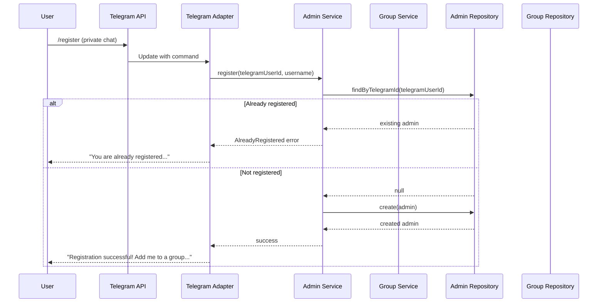
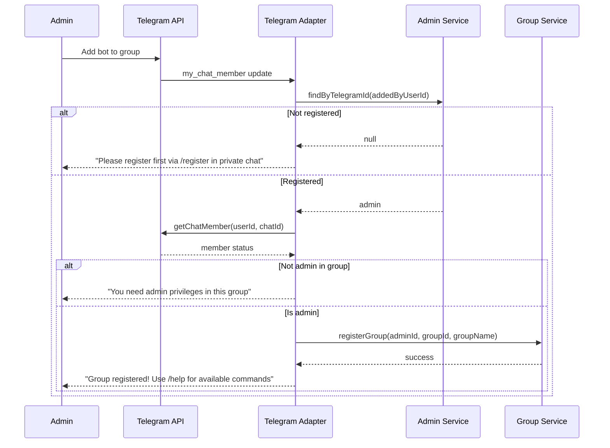

# Design Document: Telegram Account Connection

## Overview

This design document describes the Telegram Account Connection feature, which enables administrators to register with the bot and manage groups through Telegram bot commands. The system uses Telegram user IDs as the primary authentication mechanism — no passwords or separate login credentials are required.

The feature follows a Telegram-first approach where all registration and configuration is done via bot commands in private chat or group chats. The system implements multi-tenant architecture with complete data isolation between administrators.

## Architecture

The feature follows the layered architecture defined in the project's architecture guidelines:

```
┌─────────────────────────────────────────────────────────────────────┐
│                    Telegram Adapter Layer                            │
│  adapters/telegram/                                                  │
│  - Command handlers for /register, /groups, /status, etc.           │
│  - Telegram API integration (grammy)                                │
│  - Admin status verification via Telegram API                       │
├─────────────────────────────────────────────────────────────────────┤
│                    Service Layer                                     │
│  services/admin.service.ts - Administrator account management       │
│  services/group.service.ts - Group registration and management      │
│  - Business logic and validation                                    │
│  - Orchestration of repository calls                                │
├─────────────────────────────────────────────────────────────────────┤
│                    Repository Layer                                  │
│  repositories/admin.repository.ts - Administrator data access       │
│  repositories/group.repository.ts - Group data access               │
│  - Kysely-based PostgreSQL implementation                           │
│  - In-memory implementation for testing                             │
├─────────────────────────────────────────────────────────────────────┤
│                    Infrastructure Layer                              │
│  PostgreSQL (Kysely) - Persistent storage                           │
│  Telegram Bot API - Platform integration                            │
└─────────────────────────────────────────────────────────────────────┘
```

### Command Flow



### Group Registration Flow



## Components and Interfaces

### Schema Organization

```
schemas/
├── common/                    # Shared schemas (reused from keyword feature)
│   ├── error.ts               # Error response schemas
│   └── pagination.ts          # Pagination schemas
├── admin.ts                   # Administrator schemas
└── group.ts                   # Group schemas
```

### Repository Organization

```
repositories/
├── repository.ts              # Generic Repository<T> interface
├── admin.repository.ts        # AdminRepository type + implementations
└── group.repository.ts        # GroupRepository type + implementations
```

### Service Organization

```
services/
├── admin.service.ts           # AdminService class
└── group.service.ts           # GroupService class
```

### Adapter Organization

```
adapters/
└── telegram/
    ├── index.ts               # Telegram bot setup and middleware
    ├── commands/              # Command handlers
    │   ├── register.ts        # /register command
    │   ├── groups.ts          # /groups command
    │   ├── status.ts          # /status command
    │   ├── unregister.ts      # /unregister command
    │   └── delete-account.ts  # /deleteaccount command
    └── handlers/
        └── chat-member.ts     # Bot added/removed from group handler
```

### Administrator Schemas (schemas/admin.ts)

```typescript
import z from "zod";

// Administrator status enum
export const adminStatusSchema = z.enum(["active", "inactive"]);
export type AdminStatus = z.infer<typeof adminStatusSchema>;

// Administrator entity schema
export const adminSchema = z.object({
  pk: z.number().int().positive().describe("Primary key (serial)"),
  telegram_user_id: z.string().describe("Telegram user ID (stored as string for large IDs)"),
  telegram_username: z.string().nullable().describe("Telegram username (may be null)"),
  status: adminStatusSchema.default("active").describe("Account status"),
  created_at: z.string().datetime().describe("Registration timestamp"),
  updated_at: z.string().datetime().describe("Last update timestamp"),
});
export type Admin = z.infer<typeof adminSchema>;

// Create admin request (internal use)
export const createAdminSchema = z.object({
  telegram_user_id: z.string(),
  telegram_username: z.string().nullable(),
});
export type CreateAdminRequest = z.infer<typeof createAdminSchema>;

// Update admin request (internal use)
export const updateAdminSchema = z.object({
  telegram_username: z.string().nullable().optional(),
  status: adminStatusSchema.optional(),
});
export type UpdateAdminRequest = z.infer<typeof updateAdminSchema>;
```

### Group Schemas (schemas/group.ts)

```typescript
import z from "zod";

// Group status enum
export const groupStatusSchema = z.enum(["active", "inactive", "bot_removed"]);
export type GroupStatus = z.infer<typeof groupStatusSchema>;

// Group entity schema
export const groupSchema = z.object({
  pk: z.number().int().positive().describe("Primary key (serial)"),
  telegram_group_id: z.string().describe("Telegram group/chat ID (stored as string)"),
  group_name: z.string().describe("Group name at registration time"),
  admin_pk: z.number().int().positive().describe("FK to administrator who registered the group"),
  status: groupStatusSchema.default("active").describe("Group status"),
  created_at: z.string().datetime().describe("Registration timestamp"),
  updated_at: z.string().datetime().describe("Last update timestamp"),
});
export type Group = z.infer<typeof groupSchema>;

// Create group request (internal use)
export const createGroupSchema = z.object({
  telegram_group_id: z.string(),
  group_name: z.string(),
  admin_pk: z.number().int().positive(),
});
export type CreateGroupRequest = z.infer<typeof createGroupSchema>;

// Update group request (internal use)
export const updateGroupSchema = z.object({
  group_name: z.string().optional(),
  status: groupStatusSchema.optional(),
});
export type UpdateGroupRequest = z.infer<typeof updateGroupSchema>;

// Group list item for /groups command response
export const groupListItemSchema = z.object({
  pk: z.number().int().positive(),
  telegram_group_id: z.string(),
  group_name: z.string(),
  status: groupStatusSchema,
  created_at: z.string().datetime(),
});
export type GroupListItem = z.infer<typeof groupListItemSchema>;
```

### Admin Repository Interface (repositories/admin.repository.ts)

```typescript
import type {Admin, CreateAdminRequest, UpdateAdminRequest} from "../schemas/admin";
import type {Repository} from "./repository";

// AdminRepository extends generic Repository with admin-specific methods
export type AdminRepository = Repository<Admin, CreateAdminRequest, UpdateAdminRequest> & {
  // Find admin by Telegram user ID (primary lookup method)
  findByTelegramId(telegramUserId: string): Promise<Admin | null>;
};
```

### Group Repository Interface (repositories/group.repository.ts)

```typescript
import type {Group, CreateGroupRequest, UpdateGroupRequest, GroupListItem} from "../schemas/group";
import type {Repository} from "./repository";

// GroupRepository extends generic Repository with group-specific methods
export type GroupRepository = Repository<Group, CreateGroupRequest, UpdateGroupRequest> & {
  // Find group by Telegram group ID
  findByTelegramGroupId(telegramGroupId: string): Promise<Group | null>;
  
  // Find all groups for an administrator
  findAllByAdminPk(adminPk: number): Promise<GroupListItem[]>;
  
  // Count groups for an administrator
  countByAdminPk(adminPk: number): Promise<number>;
  
  // Delete all groups for an administrator (cascade delete)
  deleteAllByAdminPk(adminPk: number): Promise<number>;
  
  // Mark all groups as inactive for an administrator
  markAllInactiveByAdminPk(adminPk: number): Promise<number>;
};
```

### Admin Service Interface (services/admin.service.ts)

```typescript
import type {Admin, CreateAdminRequest, UpdateAdminRequest} from "../schemas/admin";
import type {AdminRepository} from "../repositories/admin.repository";
import type {GroupRepository} from "../repositories/group.repository";

// Service error types
export type AdminServiceError = {
  type: "already_registered" | "not_registered" | "not_found";
  message: string;
};

export type AdminServiceResult<T> = {ok: true; data: T} | {ok: false; error: AdminServiceError};

export class AdminService {
  constructor(
    private adminRepo: AdminRepository,
    private groupRepo: GroupRepository,
  ) {}

  // Register a new administrator
  async register(telegramUserId: string, telegramUsername: string | null): Promise<AdminServiceResult<Admin>> {
    const existing = await this.adminRepo.findByTelegramId(telegramUserId);
    if (existing) {
      // If inactive, reactivate
      if (existing.status === "inactive") {
        const updated = await this.adminRepo.update(existing.pk, {status: "active"});
        return {ok: true, data: updated!};
      }
      return {
        ok: false,
        error: {type: "already_registered", message: "You are already registered"},
      };
    }

    const admin = await this.adminRepo.create({
      telegram_user_id: telegramUserId,
      telegram_username: telegramUsername,
    });
    return {ok: true, data: admin};
  }

  // Get administrator by Telegram user ID
  async getByTelegramId(telegramUserId: string): Promise<AdminServiceResult<Admin>> {
    const admin = await this.adminRepo.findByTelegramId(telegramUserId);
    if (!admin || admin.status === "inactive") {
      return {
        ok: false,
        error: {type: "not_registered", message: "You are not registered. Use /register to get started."},
      };
    }
    return {ok: true, data: admin};
  }

  // Get admin status with group count
  async getStatus(telegramUserId: string): Promise<AdminServiceResult<{admin: Admin; groupCount: number}>> {
    const result = await this.getByTelegramId(telegramUserId);
    if (!result.ok) return result;

    const groupCount = await this.groupRepo.countByAdminPk(result.data.pk);
    return {ok: true, data: {admin: result.data, groupCount}};
  }

  // Delete administrator account and all associated data
  async deleteAccount(telegramUserId: string): Promise<AdminServiceResult<void>> {
    const result = await this.getByTelegramId(telegramUserId);
    if (!result.ok) return result;

    // Mark all groups as inactive (preserve data)
    await this.groupRepo.markAllInactiveByAdminPk(result.data.pk);
    
    // Delete the admin account
    await this.adminRepo.delete(result.data.pk);
    
    return {ok: true, data: undefined};
  }

  // Update admin username (called when username changes)
  async updateUsername(telegramUserId: string, newUsername: string | null): Promise<void> {
    const admin = await this.adminRepo.findByTelegramId(telegramUserId);
    if (admin) {
      await this.adminRepo.update(admin.pk, {telegram_username: newUsername});
    }
  }
}
```

### Group Service Interface (services/group.service.ts)

```typescript
import type {Group, GroupListItem} from "../schemas/group";
import type {GroupRepository} from "../repositories/group.repository";
import type {AdminRepository} from "../repositories/admin.repository";

// Service error types
export type GroupServiceError = {
  type: "not_found" | "already_registered" | "not_admin" | "admin_not_registered";
  message: string;
};

export type GroupServiceResult<T> = {ok: true; data: T} | {ok: false; error: GroupServiceError};

export class GroupService {
  constructor(
    private groupRepo: GroupRepository,
    private adminRepo: AdminRepository,
  ) {}

  // Register a new group
  async registerGroup(
    adminTelegramId: string,
    telegramGroupId: string,
    groupName: string,
  ): Promise<GroupServiceResult<Group>> {
    // Verify admin is registered
    const admin = await this.adminRepo.findByTelegramId(adminTelegramId);
    if (!admin || admin.status === "inactive") {
      return {
        ok: false,
        error: {type: "admin_not_registered", message: "Please register first using /register in private chat"},
      };
    }

    // Check if group already registered
    const existing = await this.groupRepo.findByTelegramGroupId(telegramGroupId);
    if (existing && existing.status === "active") {
      return {
        ok: false,
        error: {type: "already_registered", message: "This group is already registered"},
      };
    }

    // Reactivate if previously registered but inactive
    if (existing && existing.status !== "active") {
      const updated = await this.groupRepo.update(existing.pk, {
        status: "active",
        group_name: groupName,
      });
      return {ok: true, data: updated!};
    }

    // Create new group
    const group = await this.groupRepo.create({
      telegram_group_id: telegramGroupId,
      group_name: groupName,
      admin_pk: admin.pk,
    });
    return {ok: true, data: group};
  }

  // List all groups for an administrator
  async listGroups(adminTelegramId: string): Promise<GroupServiceResult<GroupListItem[]>> {
    const admin = await this.adminRepo.findByTelegramId(adminTelegramId);
    if (!admin || admin.status === "inactive") {
      return {
        ok: false,
        error: {type: "admin_not_registered", message: "You are not registered"},
      };
    }

    const groups = await this.groupRepo.findAllByAdminPk(admin.pk);
    return {ok: true, data: groups};
  }

  // Unregister a group
  async unregisterGroup(
    adminTelegramId: string,
    telegramGroupId: string,
  ): Promise<GroupServiceResult<void>> {
    const admin = await this.adminRepo.findByTelegramId(adminTelegramId);
    if (!admin || admin.status === "inactive") {
      return {
        ok: false,
        error: {type: "admin_not_registered", message: "You are not registered"},
      };
    }

    const group = await this.groupRepo.findByTelegramGroupId(telegramGroupId);
    if (!group || group.admin_pk !== admin.pk) {
      return {
        ok: false,
        error: {type: "not_found", message: "Group not found or you don't have permission"},
      };
    }

    // Mark as inactive (preserve configuration)
    await this.groupRepo.update(group.pk, {status: "inactive"});
    return {ok: true, data: undefined};
  }

  // Mark group as bot_removed when bot is kicked
  async markBotRemoved(telegramGroupId: string): Promise<void> {
    const group = await this.groupRepo.findByTelegramGroupId(telegramGroupId);
    if (group) {
      await this.groupRepo.update(group.pk, {status: "bot_removed"});
    }
  }

  // Check if user is admin of a registered group
  async isGroupAdmin(adminTelegramId: string, telegramGroupId: string): Promise<boolean> {
    const admin = await this.adminRepo.findByTelegramId(adminTelegramId);
    if (!admin || admin.status === "inactive") return false;

    const group = await this.groupRepo.findByTelegramGroupId(telegramGroupId);
    if (!group || group.status !== "active") return false;

    return group.admin_pk === admin.pk;
  }
}
```

### Telegram Adapter - Command Handler Examples

```typescript
// adapters/telegram/commands/register.ts
import type {Context} from "grammy";
import type {AdminService} from "../../../services/admin.service";

export function createRegisterHandler(adminService: AdminService) {
  return async function registerHandler(ctx: Context) {
    // Only allow in private chat
    if (ctx.chat?.type !== "private") {
      await ctx.reply("Please use /register in a private chat with me.");
      return;
    }

    const telegramUserId = ctx.from?.id.toString();
    const telegramUsername = ctx.from?.username ?? null;

    if (!telegramUserId) {
      await ctx.reply("Unable to identify your Telegram account.");
      return;
    }

    const result = await adminService.register(telegramUserId, telegramUsername);

    if (!result.ok) {
      if (result.error.type === "already_registered") {
        await ctx.reply(
          "You are already registered! 🎉\n\n" +
          "To get started:\n" +
          "1. Add me to a Telegram group where you are an admin\n" +
          "2. Use /groups to see your registered groups\n" +
          "3. Use /status to see your account info"
        );
        return;
      }
      await ctx.reply(`Error: ${result.error.message}`);
      return;
    }

    await ctx.reply(
      "Registration successful! 🎉\n\n" +
      "To get started:\n" +
      "1. Add me to a Telegram group where you are an admin\n" +
      "2. I'll automatically register the group\n" +
      "3. Use /help in the group to see available commands\n\n" +
      "Use /status to see your account info."
    );
  };
}
```

```typescript
// adapters/telegram/commands/delete-account.ts
import type {Context} from "grammy";
import type {AdminService} from "../../../services/admin.service";
import type {ConversationFlavor} from "@grammyjs/conversations";

// Pending confirmations stored in memory (userId -> timestamp)
const pendingDeletions = new Map<string, number>();
const CONFIRMATION_TIMEOUT_MS = 60000; // 1 minute

export function createDeleteAccountHandler(adminService: AdminService) {
  return async function deleteAccountHandler(ctx: Context) {
    // Only allow in private chat
    if (ctx.chat?.type !== "private") {
      await ctx.reply("Please use /deleteaccount in a private chat with me.");
      return;
    }

    const telegramUserId = ctx.from?.id.toString();
    if (!telegramUserId) {
      await ctx.reply("Unable to identify your Telegram account.");
      return;
    }

    // Check if user has a pending confirmation
    const pendingTime = pendingDeletions.get(telegramUserId);
    if (pendingTime && Date.now() - pendingTime < CONFIRMATION_TIMEOUT_MS) {
      // User is confirming deletion
      const result = await adminService.deleteAccount(telegramUserId);
      pendingDeletions.delete(telegramUserId);

      if (!result.ok) {
        await ctx.reply(`Error: ${result.error.message}`);
        return;
      }

      await ctx.reply(
        "Your account and all associated data has been deleted. 👋\n\n" +
        "All your groups have been unregistered. " +
        "You can register again anytime with /register."
      );
      return;
    }

    // First request - ask for confirmation
    pendingDeletions.set(telegramUserId, Date.now());
    
    await ctx.reply(
      "⚠️ Are you sure you want to delete your account?\n\n" +
      "This will:\n" +
      "• Remove your administrator account\n" +
      "• Unregister all your groups\n" +
      "• Stop monitoring for all your groups\n\n" +
      "Send /deleteaccount again within 60 seconds to confirm."
    );
  };
}
```

### Telegram Adapter - Admin Verification Middleware

```typescript
// adapters/telegram/middleware/admin-verification.ts
import type {Context, NextFunction} from "grammy";
import type {AdminService} from "../../../services/admin.service";

// Middleware to verify user is a registered administrator
export function createAdminMiddleware(adminService: AdminService) {
  return async function adminMiddleware(ctx: Context, next: NextFunction) {
    const telegramUserId = ctx.from?.id.toString();
    if (!telegramUserId) {
      await ctx.reply("Unable to identify your Telegram account.");
      return;
    }

    const result = await adminService.getByTelegramId(telegramUserId);
    if (!result.ok) {
      await ctx.reply(result.error.message);
      return;
    }

    // Attach admin to context for downstream handlers
    ctx.admin = result.data;
    await next();
  };
}

// Middleware to verify user has Telegram admin privileges in the group
export function createGroupAdminMiddleware() {
  return async function groupAdminMiddleware(ctx: Context, next: NextFunction) {
    if (!ctx.chat || ctx.chat.type === "private") {
      await next();
      return;
    }

    const userId = ctx.from?.id;
    if (!userId) {
      await ctx.reply("Unable to identify your Telegram account.");
      return;
    }

    try {
      const member = await ctx.api.getChatMember(ctx.chat.id, userId);
      const isAdmin = member.status === "administrator" || member.status === "creator";
      
      if (!isAdmin) {
        await ctx.reply("You need to be an admin in this group to use this command.");
        return;
      }

      await next();
    } catch (error) {
      await ctx.reply("Unable to verify your admin status in this group.");
    }
  };
}
```

## Data Models

### Database Schema

```sql
-- Function to auto-update updated_at timestamp
CREATE OR REPLACE FUNCTION update_updated_at_column()
RETURNS TRIGGER AS $$
BEGIN
  NEW.updated_at = NOW();
  RETURN NEW;
END;
$$ LANGUAGE plpgsql;

-- Administrators table
CREATE TABLE administrators (
  pk SERIAL PRIMARY KEY,
  telegram_user_id VARCHAR(32) NOT NULL UNIQUE,
  telegram_username VARCHAR(64),
  status VARCHAR(16) NOT NULL DEFAULT 'active',
  created_at TIMESTAMPTZ NOT NULL DEFAULT NOW(),
  updated_at TIMESTAMPTZ NOT NULL DEFAULT NOW()
);

CREATE INDEX idx_administrators_telegram_user_id ON administrators(telegram_user_id);
CREATE INDEX idx_administrators_status ON administrators(status);

CREATE TRIGGER administrators_updated_at
  BEFORE UPDATE ON administrators
  FOR EACH ROW
  EXECUTE FUNCTION update_updated_at_column();

-- Groups table
CREATE TABLE groups (
  pk SERIAL PRIMARY KEY,
  telegram_group_id VARCHAR(32) NOT NULL,
  group_name VARCHAR(256) NOT NULL,
  admin_pk INTEGER NOT NULL REFERENCES administrators(pk) ON DELETE CASCADE,
  status VARCHAR(16) NOT NULL DEFAULT 'active',
  created_at TIMESTAMPTZ NOT NULL DEFAULT NOW(),
  updated_at TIMESTAMPTZ NOT NULL DEFAULT NOW()
);

CREATE UNIQUE INDEX idx_groups_telegram_group_id ON groups(telegram_group_id);
CREATE INDEX idx_groups_admin_pk ON groups(admin_pk);
CREATE INDEX idx_groups_status ON groups(status);

CREATE TRIGGER groups_updated_at
  BEFORE UPDATE ON groups
  FOR EACH ROW
  EXECUTE FUNCTION update_updated_at_column();
```

### Entity Relationships

```
┌─────────────────────┐       ┌─────────────────────┐
│   administrators    │       │       groups        │
├─────────────────────┤       ├─────────────────────┤
│ pk (PK)             │───┐   │ pk (PK)             │
│ telegram_user_id    │   │   │ telegram_group_id   │
│ telegram_username   │   │   │ group_name          │
│ status              │   └──►│ admin_pk (FK)       │
│ created_at          │       │ status              │
│ updated_at          │       │ created_at          │
└─────────────────────┘       │ updated_at          │
                              └─────────────────────┘
                              
One administrator can have many groups (1:N)
```

### Administrator Entity

| Field | Type | Constraints | Description |
|-------|------|-------------|-------------|
| pk | integer | Primary key, auto-increment | Unique identifier |
| telegram_user_id | varchar(32) | Unique, not null | Telegram user ID |
| telegram_username | varchar(64) | Nullable | Telegram username (without @) |
| status | varchar(16) | Not null, default 'active' | Account status: active, inactive |
| created_at | timestamptz | Not null | Registration timestamp |
| updated_at | timestamptz | Not null | Last update timestamp |

### Group Entity

| Field | Type | Constraints | Description |
|-------|------|-------------|-------------|
| pk | integer | Primary key, auto-increment | Unique identifier |
| telegram_group_id | varchar(32) | Unique, not null | Telegram group/chat ID |
| group_name | varchar(256) | Not null | Group name at registration |
| admin_pk | integer | Foreign key, not null | Reference to administrator |
| status | varchar(16) | Not null, default 'active' | Status: active, inactive, bot_removed |
| created_at | timestamptz | Not null | Registration timestamp |
| updated_at | timestamptz | Not null | Last update timestamp |


## Correctness Properties

*A property is a characteristic or behavior that should hold true across all valid executions of a system—essentially, a formal statement about what the system should do. Properties serve as the bridge between human-readable specifications and machine-verifiable correctness guarantees.*

### Property 1: Registration creates unique admin with correct fields

*For any* valid Telegram user ID and optional username, calling `register()` shall create exactly one administrator record with the provided Telegram user ID, username, status="active", and valid timestamps. Subsequent registrations with the same Telegram user ID shall not create duplicate records.

**Validates: Requirements 1.1, 1.4, 1.5**

### Property 2: Duplicate registration returns already-registered error

*For any* Telegram user ID that is already registered with status="active", calling `register()` shall return an "already_registered" error and shall not modify the existing record (idempotence).

**Validates: Requirements 1.2**

### Property 3: Admin lookup by Telegram ID round-trip

*For any* registered administrator, looking up by their Telegram user ID shall return the same administrator record with all fields intact. This is a round-trip property: `findByTelegramId(register(id).telegram_user_id) == register(id)`.

**Validates: Requirements 2.1**

### Property 4: Non-registered users receive appropriate error

*For any* Telegram user ID that is not registered (or has status="inactive"), calling admin-only operations (`getByTelegramId`, `getStatus`, `listGroups`) shall return a "not_registered" error with guidance to use `/register`.

**Validates: Requirements 2.3, 4.4, 8.3**

### Property 5: Group registration creates group with correct ownership

*For any* registered administrator and valid Telegram group ID, calling `registerGroup()` shall create a group record with the correct `telegram_group_id`, `group_name`, `admin_pk` referencing the administrator, and status="active".

**Validates: Requirements 4.2, 4.5**

### Property 6: List groups returns all groups with complete information

*For any* administrator with N registered groups, calling `listGroups()` shall return exactly N groups, and each group shall include `pk`, `telegram_group_id`, `group_name`, `status`, and `created_at` fields.

**Validates: Requirements 5.1, 5.2, 5.4**

### Property 7: Unregistration preserves data with inactive status

*For any* registered group, calling `unregisterGroup()` shall change the group's status to "inactive" while preserving all other fields (`telegram_group_id`, `group_name`, `admin_pk`, `created_at`). The group record shall still exist in the database.

**Validates: Requirements 6.1, 6.3**

### Property 8: Bot removal marks group as bot_removed

*For any* registered group, calling `markBotRemoved()` shall change the group's status to "bot_removed" while preserving all configuration data.

**Validates: Requirements 6.4**

### Property 9: Account deletion cascades to groups

*For any* administrator with N groups, calling `deleteAccount()` shall remove the administrator record and mark all N associated groups as inactive. After deletion, `findByTelegramId()` shall return null for that Telegram user ID.

**Validates: Requirements 7.2**

### Property 10: Status returns complete admin info with group count

*For any* registered administrator with N groups, calling `getStatus()` shall return the administrator record with all fields plus an accurate `groupCount` equal to N.

**Validates: Requirements 8.1, 8.2**

### Property 11: Inactive accounts can be reactivated with data preserved

*For any* administrator marked as inactive, calling `register()` with the same Telegram user ID shall reactivate the account (status="active") and restore access to all previously associated groups. Group data shall remain unchanged.

**Validates: Requirements 9.2, 9.3**

### Property 12: Group isolation between administrators

*For any* two distinct administrators A and B, administrator A shall not be able to access, modify, or unregister groups belonging to administrator B. Attempting to do so shall return a "not_found" error.

**Validates: Requirements (Multi-tenant isolation from PRD-auth.md)**

## Error Handling

### Service Error Types

| Error Type | Condition | User Message |
|------------|-----------|--------------|
| `already_registered` | User calls /register when already registered | "You are already registered!" |
| `not_registered` | Non-registered user attempts admin command | "You are not registered. Use /register to get started." |
| `not_found` | Group not found or user lacks permission | "Group not found or you don't have permission" |
| `admin_not_registered` | Non-registered user tries to register group | "Please register first using /register in private chat" |
| `already_registered` (group) | Group is already registered and active | "This group is already registered" |

### Telegram API Error Handling

| Scenario | Handling |
|----------|----------|
| Cannot verify admin status | Reply with "Unable to verify your admin status in this group" |
| Bot lacks permissions | Reply with "I need admin permissions to perform this action" |
| Rate limited by Telegram | Implement exponential backoff, log warning |
| Network timeout | Retry with backoff, inform user if persistent |

### Error Response Strategy

1. **Service Layer**: Returns typed `ServiceResult<T>` with either success data or typed error
2. **Adapter Layer**: Converts service errors to user-friendly Telegram messages
3. **Logging**: All errors logged with context (user ID, group ID, command)
4. **No Stack Traces**: Never expose internal errors to users

### Graceful Degradation

- If database is unavailable, bot responds with "Service temporarily unavailable"
- If Telegram API is slow, commands timeout gracefully with user notification
- Partial failures (e.g., group registration succeeds but welcome message fails) are logged but don't fail the operation

## Testing Strategy

### Testing Approach

This feature uses a combination of unit tests and property-based tests:

- **Unit tests**: Verify specific examples, edge cases, and error conditions
- **Property tests**: Verify universal properties across randomly generated inputs
- **Integration tests**: Verify Telegram adapter behavior with mocked Telegram API

### Test Framework

- **Framework**: Node.js built-in test runner (`node:test`)
- **Assertions**: `node:assert`
- **Property Testing**: fast-check library
- **Mocking**: `node:test` mock utilities for Telegram API

### Test Categories

#### Unit Tests (Service Layer)

1. Register new administrator - verify account created
2. Register already-registered user - verify error returned
3. Register with null username - verify null stored
4. Get admin by Telegram ID - verify correct admin returned
5. Get non-existent admin - verify not_registered error
6. Get status with groups - verify group count correct
7. Delete account - verify admin removed and groups marked inactive
8. Register group - verify group created with correct admin_pk
9. Register group by non-registered user - verify error
10. Register already-registered group - verify error
11. List groups for admin - verify all groups returned
12. List groups for admin with no groups - verify empty array
13. Unregister group - verify status changed to inactive
14. Unregister group by wrong admin - verify not_found error
15. Mark bot removed - verify status changed to bot_removed
16. Reactivate inactive admin - verify status changed to active

#### Property Tests

Each property test runs minimum 100 iterations with randomly generated inputs:

1. **Property 1**: Registration uniqueness and field correctness
2. **Property 2**: Duplicate registration idempotence
3. **Property 3**: Admin lookup round-trip
4. **Property 4**: Non-registered user error handling
5. **Property 5**: Group registration correctness
6. **Property 6**: List groups completeness
7. **Property 7**: Unregistration data preservation
8. **Property 8**: Bot removal status change
9. **Property 9**: Account deletion cascade
10. **Property 10**: Status response completeness
11. **Property 11**: Account reactivation
12. **Property 12**: Group isolation

#### Integration Tests (Telegram Adapter)

1. /register command in private chat - verify success response
2. /register command in group chat - verify rejection
3. /groups command - verify formatted list
4. /status command - verify formatted status
5. /unregister command with admin privileges - verify success
6. /unregister command without admin privileges - verify rejection
7. /deleteaccount command - verify confirmation flow
8. Bot added to group by registered admin - verify group registered
9. Bot added to group by non-registered user - verify rejection message
10. Bot removed from group - verify group marked as bot_removed

### Test Data Generation (fast-check)

```typescript
import fc from "fast-check";

// Arbitrary for Telegram user IDs (large positive integers as strings)
const telegramUserIdArb = fc.bigInt({min: 1n, max: 9999999999n}).map(String);

// Arbitrary for Telegram usernames (alphanumeric, 5-32 chars)
const telegramUsernameArb = fc.option(
  fc.stringMatching(/^[a-zA-Z][a-zA-Z0-9_]{4,31}$/),
  {nil: null}
);

// Arbitrary for Telegram group IDs (can be negative for supergroups)
const telegramGroupIdArb = fc.bigInt({min: -9999999999999n, max: 9999999999999n}).map(String);

// Arbitrary for group names
const groupNameArb = fc.string({minLength: 1, maxLength: 256});
```

### Test Configuration

Property tests should be tagged with their corresponding design property:

```typescript
// Feature: telegram-account-connection, Property 1: Registration creates unique admin
it("should create unique admin with correct fields", async () => {
  await fc.assert(
    fc.asyncProperty(telegramUserIdArb, telegramUsernameArb, async (userId, username) => {
      // Test implementation
    }),
    {numRuns: 100}
  );
});
```
