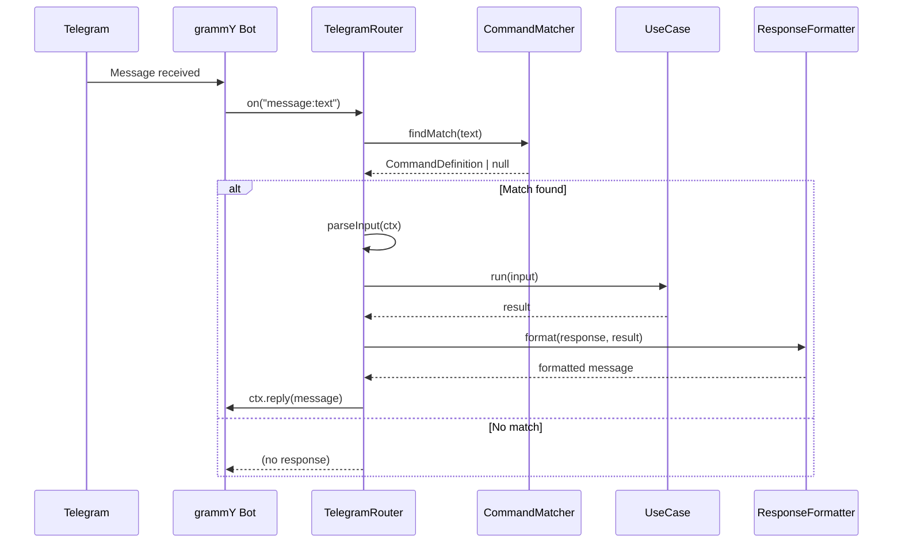
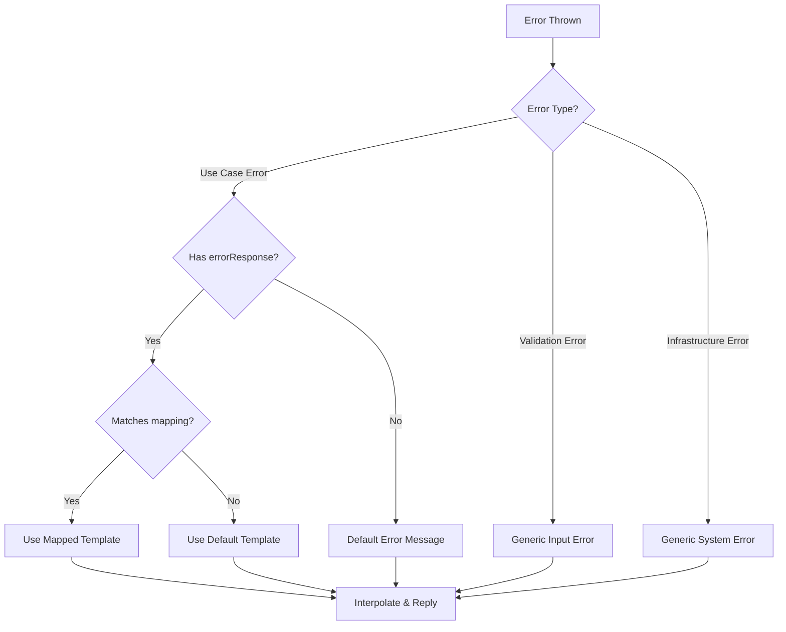

# Design Document: Telegram Router

## Overview

The Telegram Router provides a declarative command-to-use-case mapping layer for the Saimontoro bot. It wraps the grammY Telegram bot framework and routes incoming messages to existing use cases based on pattern matching, handling input parsing and response formatting through configuration rather than imperative code.

The router follows the Platform Adapter pattern from the architecture guidelines, acting as a thin controller layer that:
- Receives Telegram messages via grammY
- Matches messages against declarative command patterns
- Extracts input data from the Telegram context
- Invokes platform-agnostic use cases
- Formats use case results into Telegram-specific responses

This design keeps business logic in use cases while providing a clean, declarative interface for Telegram-specific concerns.

## Architecture

```
┌─────────────────────────────────────────────────────────────────┐
│                        Telegram Router                          │
├─────────────────────────────────────────────────────────────────┤
│                                                                 │
│  ┌──────────────┐    ┌──────────────┐    ┌──────────────────┐  │
│  │   grammY     │───▶│   Command    │───▶│   Use Case       │  │
│  │   Bot        │    │   Matcher    │    │   Executor       │  │
│  └──────────────┘    └──────────────┘    └──────────────────┘  │
│         │                   │                    │              │
│         │                   │                    ▼              │
│         │                   │           ┌──────────────────┐   │
│         │                   │           │   Response       │   │
│         │                   │           │   Formatter      │   │
│         │                   │           └──────────────────┘   │
│         │                   │                    │              │
│         ▼                   ▼                    ▼              │
│  ┌─────────────────────────────────────────────────────────┐   │
│  │                    Error Handler                         │   │
│  └─────────────────────────────────────────────────────────┘   │
│                                                                 │
└─────────────────────────────────────────────────────────────────┘
                              │
                              ▼
┌─────────────────────────────────────────────────────────────────┐
│                     Use Cases (services/)                       │
│  ┌──────────┐  ┌──────────┐  ┌──────────┐  ┌──────────────┐    │
│  │ Register │  │ GetStatus│  │ Delete   │  │ GetByTelegram│    │
│  │          │  │          │  │ Account  │  │ Id           │    │
│  └──────────┘  └──────────┘  └──────────┘  └──────────────┘    │
└─────────────────────────────────────────────────────────────────┘
```

### Component Responsibilities

1. **TelegramRouter**: Main class that orchestrates message handling
2. **Command Matcher**: Tests message text against registered patterns
3. **Use Case Executor**: Invokes use case run() with parsed input
4. **Response Formatter**: Transforms results into Telegram messages
5. **Error Handler**: Maps errors to user-friendly responses

### Data Flow



## Components and Interfaces

### TelegramRouter Class

The main router class that wraps grammY and manages command registration.

```typescript
import type {Bot, Context} from "grammy";
import type {FastifyBaseLogger} from "fastify";

type TelegramRouterOptions = {
  bot: Bot;
  logger: FastifyBaseLogger;
};

class TelegramRouter {
  private bot: Bot;
  private logger: FastifyBaseLogger;
  private commands: CommandDefinition<unknown, unknown>[] = [];

  constructor(options: TelegramRouterOptions);
  
  register<TInput, TResult>(command: CommandDefinition<TInput, TResult>): this;
  registerCommands(): void;
  start(): Promise<void>;
  stop(): Promise<void>;
}
```

### CommandDefinition Type

Declarative configuration for mapping patterns to use cases.

```typescript
type CommandDefinition<TInput, TResult> = {
  pattern: RegExp;
  useCase: {run: (input: TInput) => Promise<TResult>};
  parseInput: (ctx: Context) => TInput;
  response: ResponseConfig<TResult>;
  errorResponse?: ErrorResponseConfig;
};
```

### ResponseConfig Types

Configuration for different response formats.

```typescript
type ResponseType = "text" | "text_with_keyboard" | "list" | "silent";

type TextResponse<T> = {
  type: "text";
  template: string;
};

type TextWithKeyboardResponse<T> = {
  type: "text_with_keyboard";
  template: string;
  keyboard: KeyboardConfig<T>;
};

type ListResponse<T> = {
  type: "list";
  template: string;
  itemTemplate: string;
  itemsField: keyof T;
  emptyMessage: string;
};

type SilentResponse = {
  type: "silent";
};

type ResponseConfig<T> = 
  | TextResponse<T>
  | TextWithKeyboardResponse<T>
  | ListResponse<T>
  | SilentResponse;
```

### KeyboardConfig Type

Configuration for inline keyboards.

```typescript
type KeyboardButton<T> = {
  text: string;
  callbackData: string;
};

type KeyboardConfig<T> = {
  buttons: KeyboardButton<T>[][];
};
```

### ErrorResponseConfig Type

Configuration for error handling.

```typescript
type ErrorMapping = {
  errorType: string;  // Error class name: "NotFoundError", "ConflictError", etc.
  template: string;
};

type ErrorResponseConfig = {
  mappings: ErrorMapping[];
  defaultTemplate: string;
};
```

### ResponseFormatter Module

Pure functions for formatting responses.

```typescript
function interpolate(template: string, data: Record<string, unknown>): string;
function formatTextResponse<T>(config: TextResponse<T>, result: T): string;
function formatListResponse<T>(config: ListResponse<T>, result: T): string;
function formatErrorResponse(config: ErrorResponseConfig, error: Error): string;
```

### Template Interpolation

The interpolation function handles `{{field}}` placeholders with nested access.

```typescript
// Examples:
interpolate("Hello, {{name}}!", {name: "Alice"})
// → "Hello, Alice!"

interpolate("Welcome, {{admin.telegram_username}}!", {admin: {telegram_username: "bob"}})
// → "Welcome, bob!"

interpolate("Status: {{status}}", {status: null})
// → "Status: "
```

## Data Models

### Command Definition Schema

```typescript
import z from "zod";

const responseTypeSchema = z.enum(["text", "text_with_keyboard", "list", "silent"]);

const textResponseSchema = z.object({
  type: z.literal("text"),
  template: z.string(),
});

const keyboardButtonSchema = z.object({
  text: z.string(),
  callbackData: z.string(),
});

const keyboardConfigSchema = z.object({
  buttons: z.array(z.array(keyboardButtonSchema)),
});

const textWithKeyboardResponseSchema = z.object({
  type: z.literal("text_with_keyboard"),
  template: z.string(),
  keyboard: keyboardConfigSchema,
});

const listResponseSchema = z.object({
  type: z.literal("list"),
  template: z.string(),
  itemTemplate: z.string(),
  itemsField: z.string(),
  emptyMessage: z.string(),
});

const silentResponseSchema = z.object({
  type: z.literal("silent"),
});

const responseConfigSchema = z.discriminatedUnion("type", [
  textResponseSchema,
  textWithKeyboardResponseSchema,
  listResponseSchema,
  silentResponseSchema,
]);

const errorMappingSchema = z.object({
  errorType: z.string(),
  template: z.string(),
});

const errorResponseConfigSchema = z.object({
  mappings: z.array(errorMappingSchema),
  defaultTemplate: z.string(),
});
```

### Admin Command Definitions Example

```typescript
const adminCommands: CommandDefinition<unknown, unknown>[] = [
  {
    pattern: /^\/register$/,
    useCase: new Register(deps),
    parseInput: (ctx) => ({
      telegramUserId: String(ctx.from!.id),
      telegramUsername: ctx.from!.username ?? null,
    }),
    response: {
      type: "text",
      template: "Welcome, {{telegram_username}}! You're now registered as an admin.",
    },
    errorResponse: {
      mappings: [
        {errorType: "ConflictError", template: "You're already registered!"},
      ],
      defaultTemplate: "Registration failed: {{message}}",
    },
  },
  {
    pattern: /^\/status$/,
    useCase: new GetStatus(deps),
    parseInput: (ctx) => ({
      telegramUserId: String(ctx.from!.id),
    }),
    response: {
      type: "text",
      template: "📊 Your Status\n\nUsername: @{{admin.telegram_username}}\nGroups: {{groupCount}}",
    },
    errorResponse: {
      mappings: [
        {errorType: "NotFoundError", template: "You're not registered. Use /register first."},
      ],
      defaultTemplate: "Could not fetch status: {{message}}",
    },
  },
  {
    pattern: /^\/delete_account$/,
    useCase: new DeleteAccount(deps),
    parseInput: (ctx) => ({
      telegramUserId: String(ctx.from!.id),
    }),
    response: {
      type: "text",
      template: "Your account and all associated groups have been deleted. Goodbye! 👋",
    },
    errorResponse: {
      mappings: [
        {errorType: "NotFoundError", template: "You don't have an account to delete."},
      ],
      defaultTemplate: "Could not delete account: {{message}}",
    },
  },
];
```

### File Structure

```
pkg/bot/adapters/
└── telegram/
    ├── router.ts              # TelegramRouter class
    ├── types.ts               # Type definitions
    ├── response-formatter.ts  # Response formatting functions
    ├── template.ts            # Template interpolation
    └── index.ts               # Public exports
```


## Error Handling

### Error Categories

1. **Use Case Errors**: Errors thrown by use cases (NotFoundError, ConflictError, ValidationError)
   - Mapped to user-friendly messages via errorResponse configuration
   - Logged at error level with context

2. **Validation Errors**: Zod validation failures from parseInput
   - Treated as user input errors
   - Return generic "Invalid command format" message

3. **Infrastructure Errors**: grammY/Telegram API errors
   - Logged at error level
   - Return generic "Something went wrong" message
   - Do not expose internal details to users

### Error Response Flow



### Error Message Selection Logic

When a use case throws an error, the router determines which message to send:

1. **Check errorResponse.mappings** for a matching `errorType`
2. **If match found**: Use that mapping's `template` (the use case error message is available via `{{message}}` but only used if the template includes it)
3. **If no match found**: Use `errorResponse.defaultTemplate`

**Example:**
```typescript
errorResponse: {
  mappings: [
    {errorType: "NotFoundError", template: "You don't have an account to delete."},
  ],
  defaultTemplate: "Could not delete account: {{message}}",
}
```

- If `NotFoundError` is thrown → Reply: `"You don't have an account to delete."` (custom message, ignores error.message)
- If `ConflictError` is thrown with message "Already exists" → Reply: `"Could not delete account: Already exists"` (uses default template with interpolation)
- If `ValidationError` is thrown with message "Invalid input" → Reply: `"Could not delete account: Invalid input"`

The `{{message}}` placeholder in templates is replaced with `error.message` from the thrown error. This allows:
- **Fixed messages**: Use a template without `{{message}}` for user-friendly text that hides technical details
- **Dynamic messages**: Include `{{message}}` to show the actual error message from the use case

### Error Logging

All errors are logged with:
- Error type/name
- Error message
- User ID (not username for privacy)
- Command pattern that was matched
- Timestamp
- Stack trace (at debug level only)


